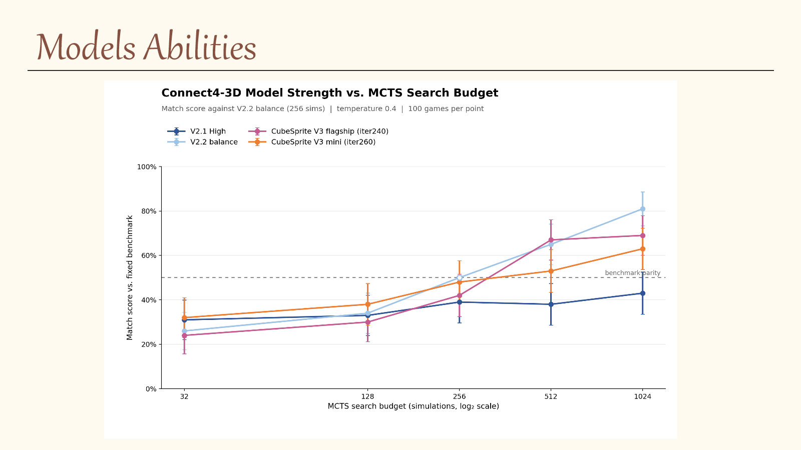
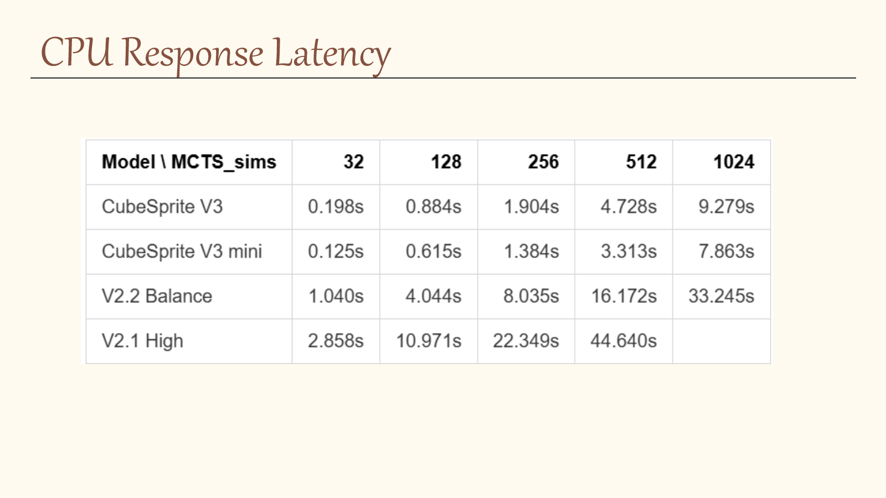

# Connect4 3D CubeSprite

Connect4 3D CubeSprite is an offline Windows game for a gravity-based
three-dimensional Connect Four variant. The board has six layers of `5 × 5`
cells, and the first player to connect four pieces in any valid 3D direction
wins.

The project combines a Tauri and React desktop interface with local AlphaZero-
style models. All gameplay, MCTS search, hints, replay analysis, and model
inference run locally; the packaged application does not require Python, Node.js,
Rust, or a network connection.

## Highlights

- Play against four bundled AI choices, including CubeSprite V3 and
  CubeSprite V3 mini.
- Configure separate models and MCTS parameters for the opponent, hints, and
  win-rate analysis.
- Inspect the six-layer board in either 2D or an interactive 3D view.
- Save, import, export, and replay games with step-by-step navigation.
- Request a read-only AI recommendation for the current replay position.
- Continue a new game from any non-terminal replay position.
- Run entirely offline with ONNX Runtime inference.

## Download

Prebuilt Windows installers are published on the repository's
[Releases](https://github.com/HerobrinejimmyWang/Connect4_3D_CubeSprite/releases)
page when a release is ready. The `release/` directory contains versioned
release notes, benchmark evidence, charts, and presentation sources; large
videos and installers are distributed as release assets rather than committed
to Git.

The first prepared release is [v0.1.0](release/v0.1.0/README.md).

## Bundled models

| Model | Role | Training lineage |
| --- | --- | --- |
| CubeSprite V3 | Flagship gravity-specialized model | Distilled from v2.2 Balance, then teacher-protected self-play through iteration 240 |
| CubeSprite V3 mini | Compact gravity-specialized model | Distilled from v2.2 Balance, followed by league and opening RL, then self-play through iteration 260 |
| v2.2 Balance | Stable full-size teacher | Warm-started from v2.2 Large data and trained with four-thread, 512-simulation self-play |
| v2.1 High | Adapted legacy model | Traditional four-block 3D AlphaZero model trained for about 50 iterations on CPU |

### Model evaluation





These charts summarize the prepared evaluation results for the bundled models.
Strength and response time depend on the selected MCTS budget, position,
hardware, and runtime configuration; see the versioned
[test results](release/v0.1.0/test_results/) for the underlying benchmark
artifacts.

The bundled ONNX files are tracked with Git LFS and verified against SHA-256
hashes in the model registry before loading. A detailed, author-written account
of the model lineage, approximate training history, limitations, and remaining
uncertainty is available in
[Model Training History](release/v0.1.0/MODEL_TRAINING_HISTORY.md).

The V3 family uses an internal 25-column gravity-aware policy head instead of
learning 150 independent cell logits. Its export path maps those column logits
back into the shared 150-action game protocol. The public model-weight package
uses the original PyTorch `.pth` checkpoints for research and conversion; the
desktop application and planned Android Beta use ONNX exports for local runtime
inference.

The current repository is focused on the verified game client and desktop
release. Historical training code is retained separately as
`legacy-training` because that pipeline has not yet completed the same level of
end-to-end validation.

## Repository layout

| Path | Purpose |
| --- | --- |
| `desktop_app/` | Tauri 2, React, TypeScript, Python sidecar, and packaged models |
| `connect4_core/` | Shared board rules and game primitives |
| `connect4_runtime/` | Runtime agent and model abstractions |
| `game_client/` | Lightweight Python client |
| `arena/` | Match, evaluation, history, and replay tools |
| `training/` | Training-related source retained in this branch |
| `distillation/` | Model distillation and export workflows |
| `release/` | Versioned release notes and benchmark evidence |

## Development

The desktop application requires Node.js, pnpm, Rust stable MSVC, Visual C++
Build Tools, the Windows SDK, and a Python environment for rebuilding the
sidecar.

```powershell
cd desktop_app
pnpm install --frozen-lockfile
pnpm typecheck
pnpm test
pnpm build
pnpm tauri build
```

Backend validation is run from the repository root:

```powershell
python -m unittest discover -s desktop_app\backend\tests -v
python -m unittest discover -s desktop_app\tests_backend -v
python -m compileall connect4_core connect4_runtime arena game_client desktop_app\backend
```

See [desktop_app/README.md](desktop_app/README.md) for architecture, model
packaging, protocol, and build details.

## Feedback and contributions

Bug reports, compatibility reports, and replay examples are welcome through
GitHub Issues. When reporting an AI or replay problem, include the application
version, selected model, MCTS settings, and an exported replay when possible.
See [CONTRIBUTING.md](CONTRIBUTING.md) before preparing a code change.

## AI usage announcement

In this repository, all the code and most materials were written by AI (LLM models). Author gave the training ideas and wrote some of the documents.

## License

Source code is released under the [MIT License](LICENSE).

Bundled model weights and third-party dependencies may carry their own notices
or upstream terms. Before the public release, model provenance and any required
third-party notices should be reviewed and documented alongside the model
training history.
