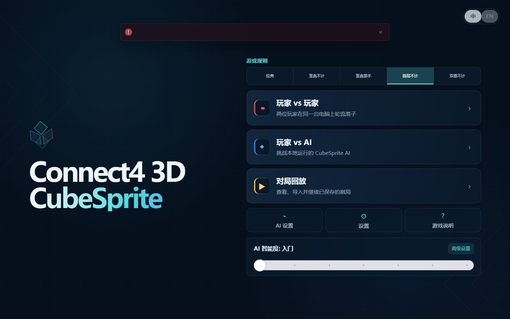
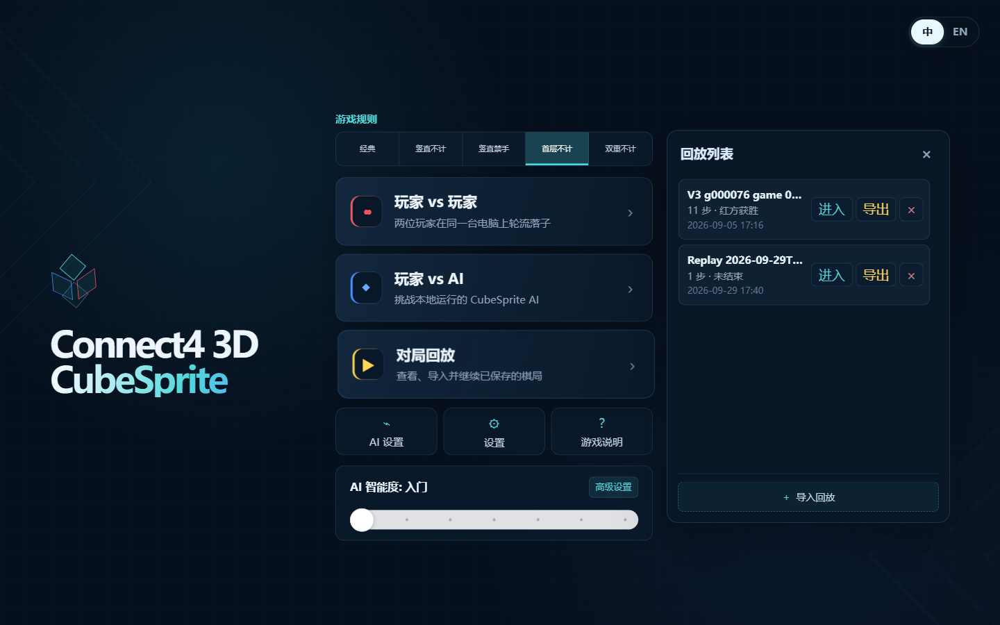
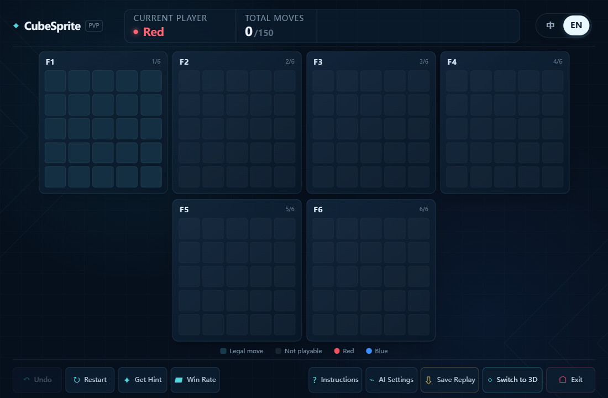
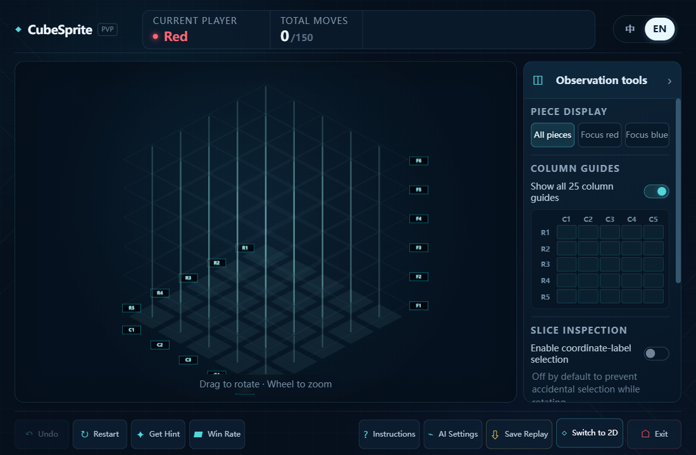
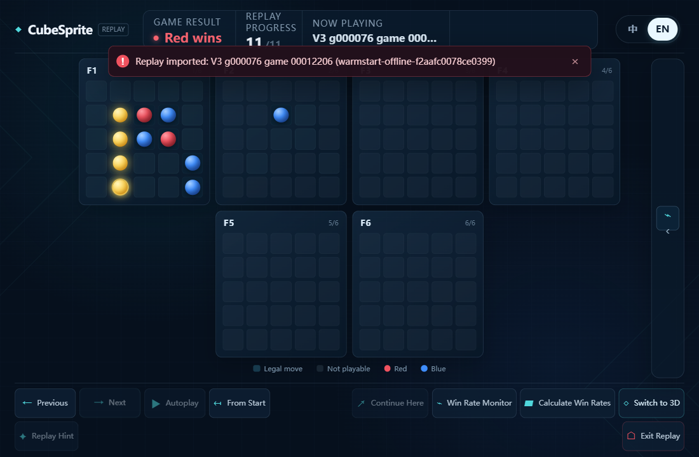

# Windows v0.2.0-alpha.1 validation

This PR contains the Windows app implementation, the V3-native Flash ONNX model
through Git LFS, a training-side replay fixture, and selected release evidence.
The installer and intermediate installers remain local build outputs; they are
not Git objects. The source checkpoint remains a local, read-only export input.

## Results

- Frontend: 78 tests passed; TypeScript and production build passed.
- Python backend test entry points: 42 and 41 tests passed; these suites overlap.
- Shared game rules: 12 regressions passed.
- Installed Windows app: 52 recorded checks passed using the real Tauri IPC,
  bundled Python sidecar and ONNX runtime. See [results.json](evidence/results.json).
- Source browser layout checks: five desktop sizes, both languages, live/replay
  and 2D/3D views; all 40 states fit the viewport, and legal cells accept moves.
  See [board-size-geometry.json](evidence/board-size-geometry.json).
- Native cell widths: 38.36 px at 1100×720, 37.13 px at 1280×720, and 43.40 px
  at 1536×792. The minimum-window board grew from 740 px to 960 px while keeping
  all six layers and the bottom controls visible.
- Final installer SHA-256:
  `98c8afb1d0cd57b5878849a9867165e63cf22c537cdf485805e348f424482724`.
  Installed model and sidecar hashes match the built resources. The installed
  executable differs only by Tauri's three-byte NSIS bundle marker.

The model was checked for functional export parity and legal search outputs,
not playing strength. No training lineage or Legacy checkpoint was converted.

## Replay provenance correction after review

The backend now keeps controller identity with retained live-history turns.
Continuing a replay preserves source participant identities, while undo/restart
removes identity records together with discarded moves. V2 exports summarize
multiple controllers in one seat as `external` with null single-controller
identifiers. Automatic forced passes do not count as model decisions.

Source validation after this correction: 49 backend tests (including seven new
provenance regressions), 41 compatibility/backend tests with overlap, 78 frontend
tests, and 12 shared-rule tests passed. TypeScript, production frontend build,
and source syntax compilation also passed. The regressions exercise v2
save/open/export validation, inherited prefixes, model changes, undo/restart,
and forced passes; bookkeeping tests isolate MCTS with deterministic search
results.

The installer hashes and native checks above describe the original release
build. The installer/sidecar was not rebuilt or rerun for this source correction;
those recorded binary checks do not verify the corrected provenance behavior.

## Reproduction

From the repository root, after installing the documented dependencies and
materializing Git LFS model files:

```powershell
python -m unittest discover -s desktop_app/backend/tests
python -m unittest discover -s desktop_app/tests_backend
python -m compileall -q connect4_core training arena distillation train_features test tools desktop_app/backend
pnpm --dir desktop_app typecheck
pnpm --dir desktop_app test
python desktop_app/scripts/e2e_windows.py --exe <installed-cubesprite.exe> --sample desktop_app/backend/tests/fixtures/training-v2-sample.c4replay.json --output <evidence-directory>
```

The native test sets `CUBESPRITE_DATA_DIR` to an absolute isolated directory and
uses separate WebView2 data. Unset, the application uses the normal platform data
directory. In this session, a standalone same-directory atomic-rename probe in
the default AppData directory also failed with WinError 17; default-path writes
are therefore not claimed verified by this run. Atomic replay writes were not
weakened. The test host already had WebView2, so first-time WebView2 installation
on a clean Windows VM was not separately tested.

## Selected screenshots







The local release folder retains additional screenshots and intermediate build
evidence; the selected files above and the complete native result log are tracked.
